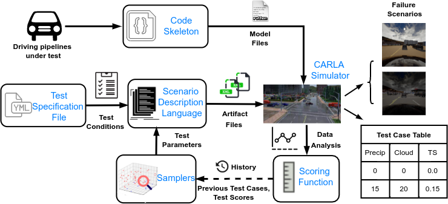

# ANTI-CARLA: An Adversarial Testing Framework for Autonomous Vehicles in CARLA

Despite recent advances in autonomous driving systems, accidents such as the fatal Uber crash in 2018 show their susceptibility to edge cases. These systems need to be thoroughly tested and validated before being deployed in the real world to avoid such events. Testing in open-world scenarios can be difficult, time-consuming, and expensive. This can be addressed by using driving simulators such as CARLA instead. A key part of such tests is adversarial testing, where the goal is to find scenarios that lead to failures of the given system. While there have been several independent efforts in adversarial testing, no established testing framework that enables adaptive stress testing is currently available for CARLA. We propose ANTI-CARLA, an adversarial testing framework in CARLA for testing autonomous driving systems. Overview of the framework is shown in the figure below. The operating conditions in which a given system should be tested are specified in a scenario description language. The framework's key capability is an adversarial search mechanism that searches for trajectories of the operating conditions that will result in a failure. This way, ANTI-CARLA extends the CARLA simulator with the capability to perform adversarial testing on any given driving pipeline. We use ANTI-CARLA to test the Learning By Cheating (LBC) approach, automatically finding a range of fail cases despite LBC reaching an accuracy of 100\% in the CARLA challenge.

<p align="center">
  
</p>


## Downloads

***Manual Downloads***

1. You will also need to install CARLA 0.9.10, along with the additional maps.
Download CARLA 0.9.10 from [here](https://github.com/carla-simulator/carla/releases/tag/0.9.10) for more instructions. (Our setup works with CARLA 0.9.10 version. Using another version of the simulator will result in a version and API mismatch error.)

Save the model.ckpt file to model_ckpt/transfuser folder. 


## Setup Virtual Environment

To run the scene generation workflow with CARLA, clone this repo.

```bash
git clone https://github.com/Shreyasramakrishna90/Testing-Framework.git
```
Then, create a conda environment to run the experiments. 

```
To run this setup first create a virtual environment with python 3.7
conda create -n carla-sampling python=3.7
conda activate carla-sampling
python3 -m pip install -r requirements.txt
cd Testing-Framework
./make_volume_folder.sh  
```

# Adapter Glue Code
The framework allows the user test their controllers through a pluggable code skeleton. There are some rules and constraints that needs to be followes in defining the user code. Violating these rules will throw errors.

To evaluate the framwork, put the tested agent under
```
/transfuser/leaderboard/team_code
```
For example look at the **transfuser_agent.py** and **image_agent.py** scripts in the [team_code](https://github.com/Shreyasramakrishna90/Testing-Framework/tree/main/leaderboard/team_code) folder. These files are taken from the respective controller github repos. 

Further, there could be several utility files required for running the controller. Create a folder in the main repo path and add all the files. For example, we have created the [transfuser](https://github.com/Shreyasramakrishna90/Testing-Framework/tree/main/transfuser) and [carla_project](https://github.com/Shreyasramakrishna90/Testing-Framework/tree/main/carla_project) folders for the transfuser and learning by cheating controllers.

# Running the Carla setup 

***Launch Simulation***

In terminal 1, launch the simulator

```
 ./CarlaUE4.sh -quality-level=Epic -world-port=2000 -resx=400 -resy=300 -opengl &
```

In terminal 2, launch the framework

```
./run_evaluation.sh
```
You will need to make the following changes in the ./run_evaluation file. This script has a few variables that need to be set before execution. 

1. PROJECT_PATH: Set this to the location of this repo. 
2. PORT: The simulator port (default:2000)
3. HAS_DISPLAY: 1 = display simulation run, 2 = headless mode (no display)


## References

The experiments in this work are built using these two works.

1. Transfuser [[paper]](https://openaccess.thecvf.com/content/CVPR2021/html/Prakash_Multi-Modal_Fusion_Transformer_for_End-to-End_Autonomous_Driving_CVPR_2021_paper.html) - Transfuser is one of the controllers that we have integrated with this framework. [[GitHub]](https://github.com/autonomousvision/transfuser)

2. Learning By Cheating [[paper]](https://arxiv.org/abs/1912.12294) - Is the other controller integrated into the framework [[GitHub]](https://github.com/bradyz/2020_CARLA_challenge) 

3. The samplers are taken from our previous work "Risk Aware Scene Sampling for Autonomous Cyber-Physical System" [[paper]](https://scholar.google.com/citations?view_op=view_citation&hl=en&user=M6Yu9GEAAAAJ&citation_for_view=M6Yu9GEAAAAJ:hqOjcs7Dif8C) [[GitHub]](https://github.com/Shreyasramakrishna90/Risk-Aware-Scene-Generation/blob/main/README.md)

